Unit 2
========================================================


```r
# R code from vignette source 'unit2.Rnw'

# code chunk number 1: unit2.Rnw:51-52
options(width = 36)


# code chunk number 2: plotmeuse (eval = FALSE)
library(sp)
```

```
## Warning: package 'sp' was built under R version 3.0.3
```

```r
library(gstat)
```

```
## Warning: package 'gstat' was built under R version 3.0.3
```

```
## Error: package or namespace load failed for 'gstat'
```

```r
data(meuse)
data(meuse.grid)
coords <- SpatialPoints(meuse[, c("x", "y")])

meuse1 <- SpatialPointsDataFrame(coords, meuse)


plot(as(meuse1, "Spatial"), axes = TRUE)
plot(meuse1, add = TRUE)
plot(meuse1[meuse1$ffreq == 1, ], col = "green", add = TRUE)
```

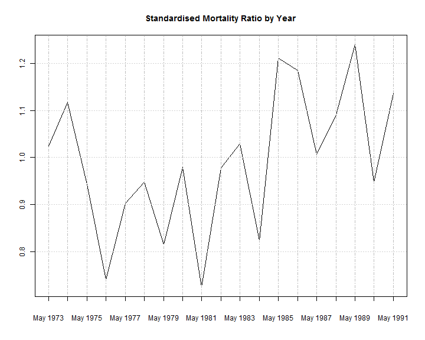 

```r


# code chunk number 3: unit2.Rnw:71-72
options(width = 60)
```


```r
# code chunk number 4: unit2.Rnw:77-78
load("results/unit1.RData")


# code chunk number 5: plottornado (eval = FALSE)
library(sp)

plot(as(storn2, "Spatial"), axes = TRUE)
plot(storn2, add = TRUE)
plot(storn2[storn2$EFscale == 4, ], col = "red", add = TRUE)
```

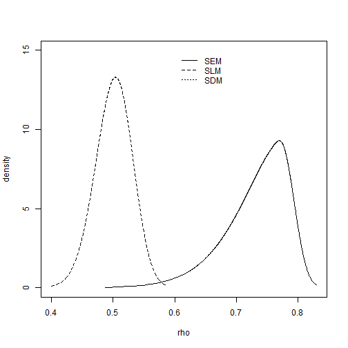 


```r
# code chunk number 6: unit2.Rnw:98-101 oopar <-
# par(mar=c(3,3,1,1)+0.1)
library(sp)

plot(as(storn2, "Spatial"), axes = TRUE)
plot(storn2, add = TRUE)
plot(storn2[storn2$EFscale == 4, ], col = "red", add = TRUE)
```

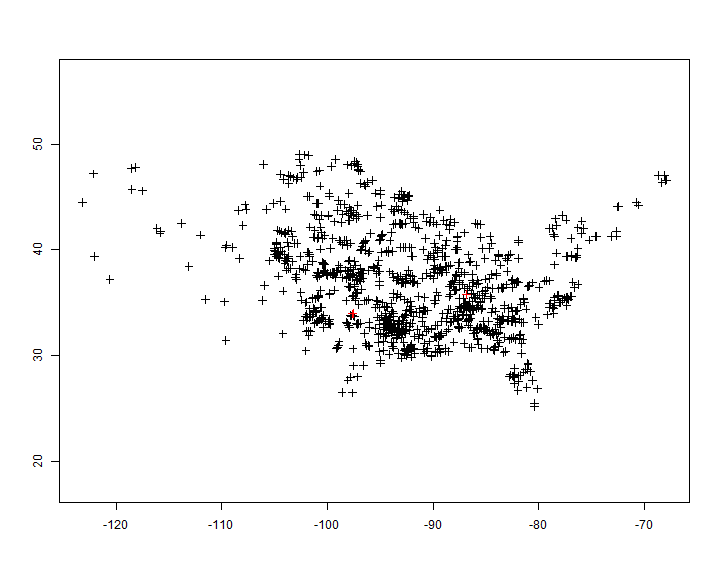 

```r

# par(oopar)


# code chunk number 7: unit2.Rnw:108-109 (eval = FALSE)
library(sp)

plot(as(storn2, "Spatial"), axes = TRUE)
plot(storn2, add = TRUE)
plot(storn2[storn2$EFscale == 4, ], col = "red", add = TRUE)
```

 


```r

# code chunk number 8: plotstatesth (eval = FALSE)
# plot(rivers, axes=TRUE, col='azure1', ylim=c(329400,
# 334000))
library(sp)

kansas <- statesth[statesth$NAME == "Kansas", ]


plot(statesth, axes = TRUE, xlim = c(-103, -94), ylim = c(36, 
    41))
plot(statesth[statesth$NAME == "Kansas", ], col = "azure2", add = TRUE)
box()
```

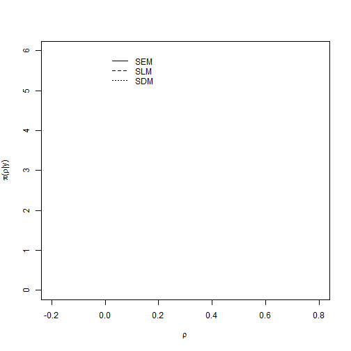 

# Plotting a `spatialPolygon` object (Kansas)

```r

# code chunk number 9: unit2.Rnw:137-140 oopar <-
# par(mar=c(3,3,1,1)+0.1) plot(rivers, axes=TRUE,
# col='azure1', ylim=c(329400, 334000))
library(sp)

kansas <- statesth[statesth$NAME == "Kansas", ]


plot(statesth, axes = TRUE, xlim = c(-103, -94), ylim = c(36, 
    41))
plot(statesth[statesth$NAME == "Kansas", ], col = "azure2", add = TRUE)
box()
```

 

```r
# par(oopar)


# code chunk number 10: unit2.Rnw:147-148
options(width = 45)
```


```r

# code chunk number 11: unit2.Rnw:151-152
# (eval = FALSE) plot(rivers, axes=TRUE,
# col='azure1', ylim=c(329400, 334000))
library(sp)

kansas <- statesth[statesth$NAME == "Kansas", 
    ]


plot(statesth, axes = TRUE, xlim = c(-103, -94), 
    ylim = c(36, 41))
plot(statesth[statesth$NAME == "Kansas", ], col = "azure2", 
    add = TRUE)
box()
```

 


```r

# code chunk number 12: unit2.Rnw:154-155
options(width = 60)


# code chunk number 13: plotpixels (eval =
# FALSE) coords <-
# SpatialPixels(SpatialPoints(meuse.grid[,
# c('x', 'y')])) meuseg1 <-
# SpatialPixelsDataFrame(coords, meuse.grid)
# plot(meuseg1, add=TRUE, col='grey60',
# cex=0.15)

plot(grd2, add = TRUE)
```

```
## Error: plot.new has not been called yet
```

# Plotting a `spatialPixels` object (Kansas)

```r

# code chunk number 14: unit2.Rnw:182-186 oopar <-
# par(mar=c(3,3,1,1)+0.1) plot(rivers, axes=TRUE,
# col='azure1', ylim=c(329400, 334000))
library(sp)

kansas <- statesth[statesth$NAME == "Kansas", ]


plot(statesth, axes = TRUE, xlim = c(-103, -94), ylim = c(36, 
    41))
plot(statesth[statesth$NAME == "Kansas", ], col = "azure2", add = TRUE)
box()
# coords <- SpatialPixels(SpatialPoints(meuse.grid[, c('x',
# 'y')])) meuseg1 <- SpatialPixelsDataFrame(coords,
# meuse.grid) plot(meuseg1, add=TRUE, col='grey60', cex=0.15)

plot(grd2, add = TRUE)
```

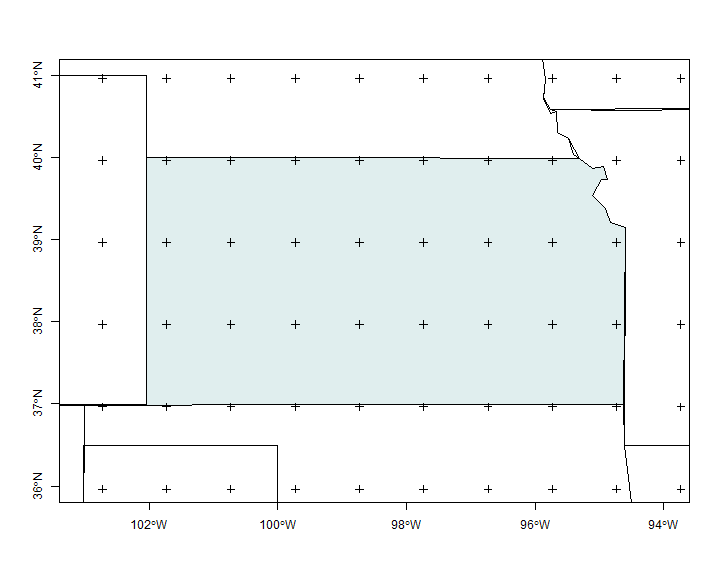 

```r
# par(oopar)


# code chunk number 15: unit2.Rnw:193-194
options(width = 45)


# code chunk number 16: unit2.Rnw:197-199 (eval = FALSE)
# plot(rivers, axes=TRUE, col='azure1', ylim=c(329400,
# 334000))
library(sp)

kansas <- statesth[statesth$NAME == "Kansas", ]


plot(statesth, axes = TRUE, xlim = c(-103, -94), ylim = c(36, 
    41))
plot(statesth[statesth$NAME == "Kansas", ], col = "azure2", add = TRUE)
box()
# coords <- SpatialPixels(SpatialPoints(meuse.grid[, c('x',
# 'y')])) meuseg1 <- SpatialPixelsDataFrame(coords,
# meuse.grid) plot(meuseg1, add=TRUE, col='grey60', cex=0.15)

plot(grd2, add = TRUE)
```

 

```r


# code chunk number 17: unit2.Rnw:201-202
options(width = 60)


# code chunk number 18: ptffreq (eval = FALSE) meuse1$ffreq1
# <- as.numeric(meuse1$ffreq) plot(meuse1, col=meuse1$ffreq1,
# pch=19)
kidx <- overlay(grd2, kansas)

grd2df <- SpatialPointsDataFrame(grd2, data.frame(KANSAS = as.factor(!is.na(kidx))))
# levels(grd2df$KANSAS)<-c('', 'KANSAS')

plot(grd2df, col = grd2df$KANSAS, pch = 19)

labs <- c("OFF KANSAS", "IN KANSAS")
cols <- 1:2
legend("topleft", legend = labs, col = cols, pch = 19, bty = "n")
```

 

```r


# code chunk number 19: unit2.Rnw:250-253 oopar <-
# par(mar=c(1,1,1,1)+0.1) meuse1$ffreq1 <-
# as.numeric(meuse1$ffreq) plot(meuse1, col=meuse1$ffreq1,
# pch=19)
kidx <- overlay(grd2, kansas)

grd2df <- SpatialPointsDataFrame(grd2, data.frame(KANSAS = as.factor(!is.na(kidx))))
# levels(grd2df$KANSAS)<-c('', 'KANSAS')

plot(grd2df, col = grd2df$KANSAS, pch = 19)

labs <- c("OFF KANSAS", "IN KANSAS")
cols <- 1:2
legend("topleft", legend = labs, col = cols, pch = 19, bty = "n")
```

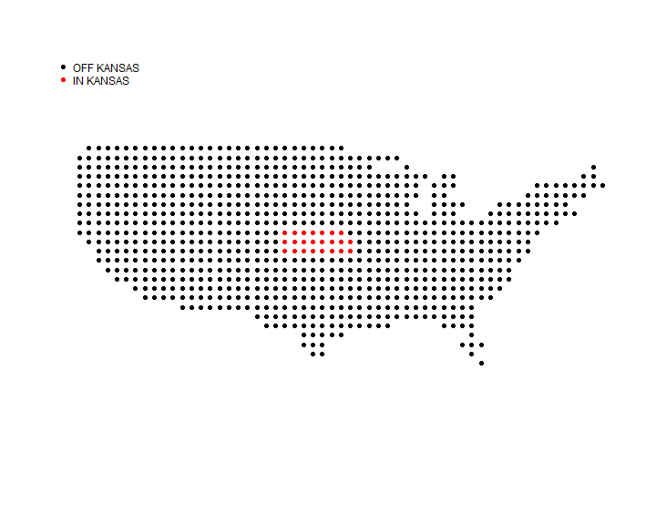 

```r
# par(oopar)


# code chunk number 20: unit2.Rnw:260-261
options(width = 45)


# code chunk number 21: unit2.Rnw:263-264 (eval = FALSE)
# meuse1$ffreq1 <- as.numeric(meuse1$ffreq) plot(meuse1,
# col=meuse1$ffreq1, pch=19)
kidx <- overlay(grd2, kansas)

grd2df <- SpatialPointsDataFrame(grd2, data.frame(KANSAS = as.factor(!is.na(kidx))))
# levels(grd2df$KANSAS)<-c('', 'KANSAS')

plot(grd2df, col = grd2df$KANSAS, pch = 19)

labs <- c("OFF KANSAS", "IN KANSAS")
cols <- 1:2
legend("topleft", legend = labs, col = cols, pch = 19, bty = "n")
```

 

```r


# code chunk number 22: unit2.Rnw:266-267
options(width = 60)


# code chunk number 23: lncols (eval = FALSE)
library(maptools)
```

```
## Warning: package 'maptools' was built under R version 3.0.3
```

```
## Checking rgeos availability: TRUE
```

```r
volcano_sl <- ContourLines2SLDF(contourLines(volcano))

volcano_sl$level1 <- as.numeric(volcano_sl$level)
pal <- terrain.colors(nlevels(volcano_sl$level))
plot(volcano_sl, bg = "grey70", col = pal[volcano_sl$level1], 
    lwd = 3)
```

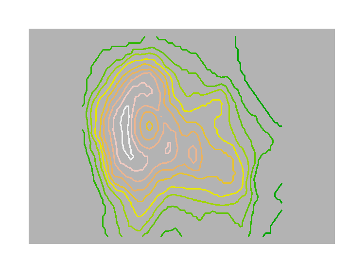 

```r


# code chunk number 24: unit2.Rnw:292-295
oopar <- par(mar = c(1, 1, 1, 1) + 0.1)
library(maptools)
volcano_sl <- ContourLines2SLDF(contourLines(volcano))

volcano_sl$level1 <- as.numeric(volcano_sl$level)
pal <- terrain.colors(nlevels(volcano_sl$level))
plot(volcano_sl, bg = "grey70", col = pal[volcano_sl$level1], 
    lwd = 3)
```

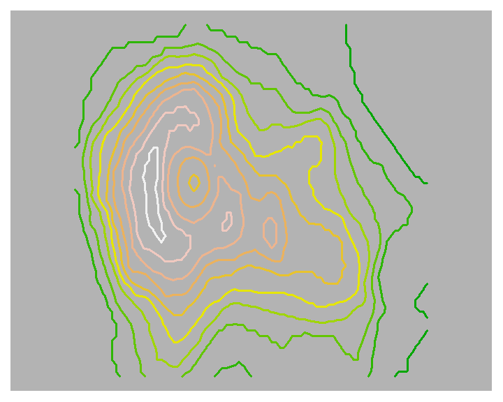 

```r
par(oopar)


# code chunk number 25: unit2.Rnw:302-303
options(width = 35)


# code chunk number 26: unit2.Rnw:306-307 (eval = FALSE)
library(maptools)
volcano_sl <- ContourLines2SLDF(contourLines(volcano))

volcano_sl$level1 <- as.numeric(volcano_sl$level)
pal <- terrain.colors(nlevels(volcano_sl$level))
plot(volcano_sl, bg = "grey70", col = pal[volcano_sl$level1], 
    lwd = 3)
```

 

```r


# code chunk number 27: unit2.Rnw:309-310
options(width = 60)

```

# Meuse 

```r
# code chunk number 28: grdffreq (eval = FALSE)
meuseg1$ffreq1 <- as.numeric(meuseg1$ffreq)
```

```
## Error: object 'meuseg1' not found
```

```r
image(meuseg1, "ffreq1", col = cols)
```

```
## Error: object 'meuseg1' not found
```

```r
legend("topleft", legend = labs, fill = cols, bty = "n")
```

```
## Error: plot.new has not been called yet
```

```r


# code chunk number 29: unit2.Rnw:380-381
options(width = 72)


# code chunk number 30: unit2.Rnw:383-393

storn2$LLoss <- log(storn2$Loss + 1e-04)

library(classInt)
```

```
## Warning: package 'classInt' was built under R version 3.0.3
```

```r
library(RColorBrewer)
pal <- brewer.pal(3, "Blues")
q5 <- classIntervals(storn2$LLoss, n = 5, style = "quantile")
q5
```

```
## style: quantile
##   one of 8,495,410 possible partitions of this variable into 5 classes
##   [-9.21,-9.21)   [-9.21,-9.21)  [-9.21,-3.907) [-3.907,-2.302) 
##               0               0             697             210 
##  [-2.302,4.868] 
##             261
```

```r
fj5 <- classIntervals(storn2$LLoss, n = 5, style = "fisher")
fj5
```

```
## style: fisher
##   one of 8,495,410 possible partitions of this variable into 5 classes
##   [-9.21,-8.011)  [-8.011,-4.706)  [-4.706,-2.772) [-2.772,-0.5024) 
##              504              116              245              218 
##  [-0.5024,4.868] 
##               85
```


```r

# code chunk number 31: unit2.Rnw:395-397 (eval = FALSE)
plot(q5, pal = pal)
```

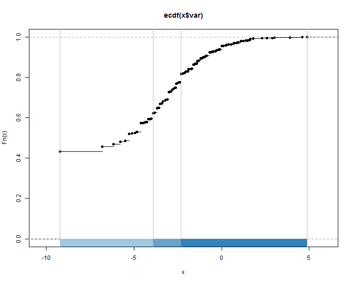 

```r
plot(fj5, pal = pal)
```

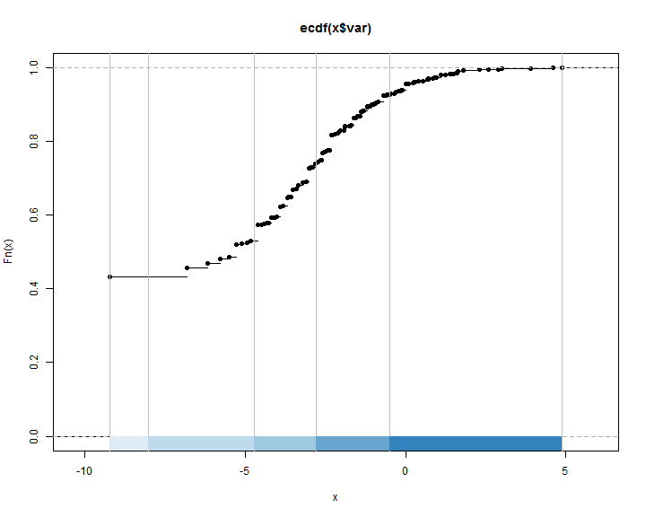 

```r


# code chunk number 32: unit2.Rnw:399-400
options(width = 36)


# code chunk number 33: unit2.Rnw:411-414 oopar <-
# par(mar=c(3,3,3,1)+0.1)
plot(q5, pal = pal, main = "Quantile", xlab = "", ylab = "")
```

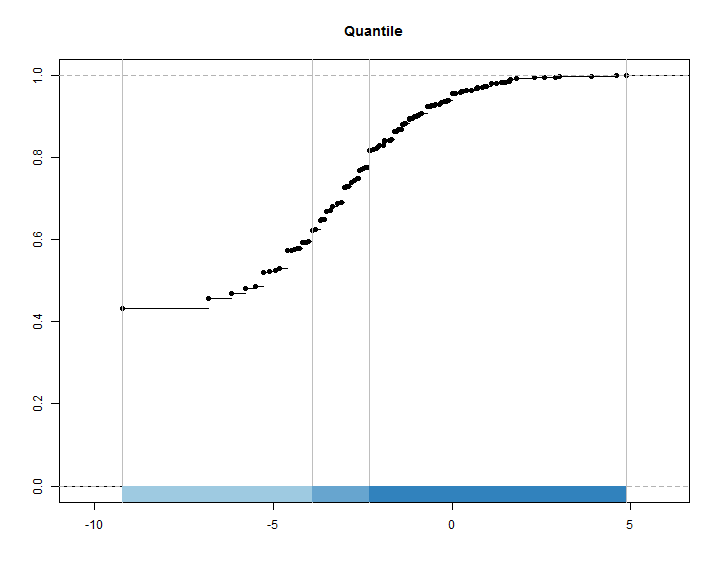 

```r
# par(oopar)


# code chunk number 34: unit2.Rnw:419-422 oopar <-
# par(mar=c(3,3,3,1)+0.1)
plot(fj5, pal = pal, main = "Fisher-Jenks natural breaks", xlab = "", ylab = "")
```

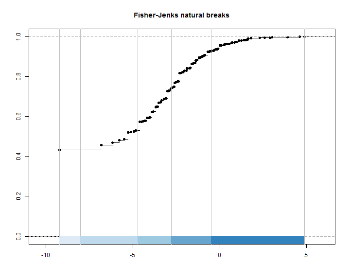 

```r
# par(oopar)
```


```r
# code chunk number 35:
# unit2.Rnw:435-441 oopar <-
# par(mar=c(1,1,3,1)+0.1,
# bg='wheat1')
q5Colours <- findColours(q5, pal)
plot(storn2, col = q5Colours, pch = 19)
title(main = "Quantile")
legend("topleft", fill = attr(q5Colours, 
    "palette"), legend = names(attr(q5Colours, 
    "table")), bty = "n")
```

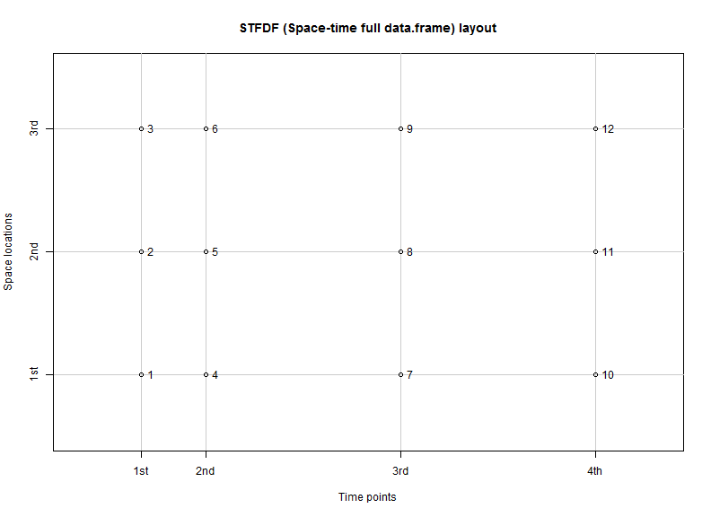 

```r
# par(oopar)
```


```r
# code chunk number 36:
# unit2.Rnw:446-452 oopar <-
# par(mar=c(1,1,3,1)+0.1,
# bg='wheat1')
fj5Colours <- findColours(fj5, pal)
plot(storn2, col = fj5Colours, pch = 19)
title(main = "Fisher-Jenks natural breaks")
legend("topleft", fill = attr(fj5Colours, 
    "palette"), legend = names(attr(fj5Colours, 
    "table")), bty = "n")
```

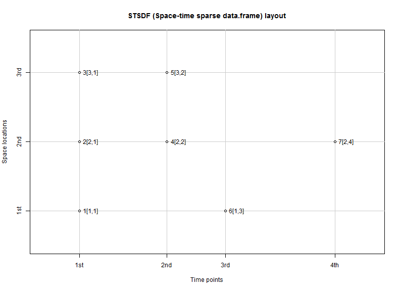 

```r
# par(oopar)
```

### Bubble Plots

```r
# code chunk number 37: znbub (eval =
# FALSE)
library(lattice)
print(bubble(storn2, "Loss", maxsize = 2, 
    key.entries = 25 * 2^(0:4)))
```

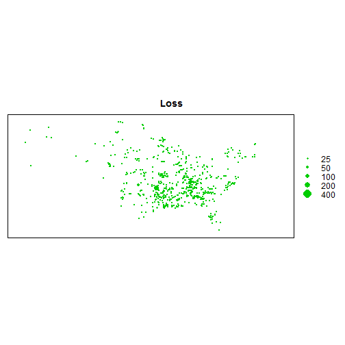 

```r


# code chunk number 38:
# unit2.Rnw:487-488
library(lattice)
print(bubble(storn2, "Loss", maxsize = 2, 
    key.entries = 25 * 2^(0:4)))
```

 

```r


# code chunk number 39:
# unit2.Rnw:495-496 (eval = FALSE)
library(lattice)
print(bubble(storn2, "Loss", maxsize = 2, 
    key.entries = 25 * 2^(0:4)))
```

 

```r


# code chunk number 40: distlev (eval
# = FALSE)
bpal <- colorRampPalette(pal)(6)
print(spplot(storn2, "LLoss", col.regions = bpal, 
    cuts = 5))
```

 

```r


# code chunk number 41:
# unit2.Rnw:514-515
bpal <- colorRampPalette(pal)(6)
print(spplot(storn2, "LLoss", col.regions = bpal, 
    cuts = 5))
```

 

```r


# code chunk number 42:
# unit2.Rnw:522-523 (eval = FALSE)
bpal <- colorRampPalette(pal)(6)
print(spplot(storn2, "LLoss", col.regions = bpal, 
    cuts = 5))
```

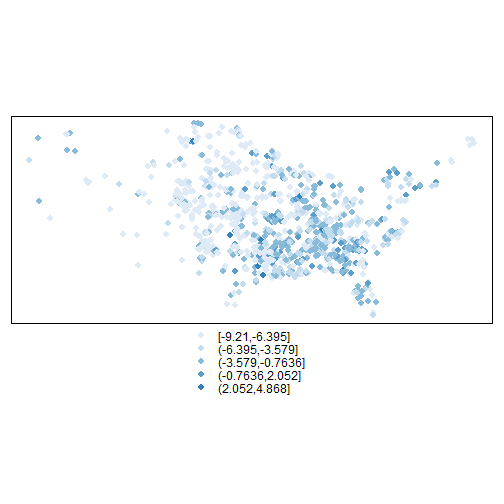 

```r

```


