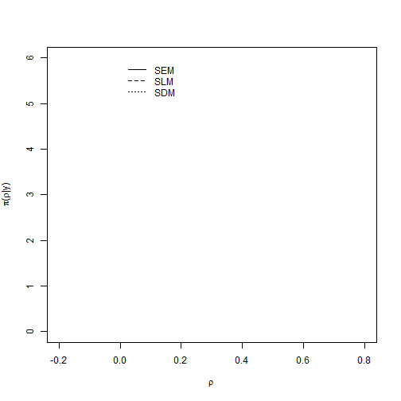

Spatial Econometrics
========================================================


```r
### R code from vignette source 'spateco.Rnw' Encoding: ISO8859-1

### code chunk number 1: spateco.Rnw:261-271
library(maptools)
```

```
## Warning: package 'maptools' was built under R version 3.0.3
```

```
## Loading required package: sp
```

```
## Warning: package 'sp' was built under R version 3.0.3
```

```
## Checking rgeos availability: TRUE
```

```r
library(spdep)
```

```
## Warning: package 'spdep' was built under R version 3.0.3
```

```
## Loading required package: Matrix
```

```
## Warning: package 'Matrix' was built under R version 3.0.3
```

```r
xx <- readShapePoly(system.file("shapes/sids.shp", package = "maptools")[1], 
    IDvar = "FIPSNO", proj4string = CRS("+proj=longlat +ellps=clrk66"))

xxnb <- poly2nb(xx)

plot(xx)
plot(xxnb, coordinates(xx), add = TRUE)
```

 

### Boston Data

```r

### code chunk number 2: spateco.Rnw:1157-1184 Load libraries
library(INLA)
```

```
## Warning: package 'INLA' was built under R version 3.1.0
```

```
## Loading required package: splines
```

```r
library(spdep)
library(parallel)


# Load data data(boston)
library(maptools)
boston.tr <- readShapePoly(system.file("etc/shapes/boston_tracts.shp", package = "spdep")[1], 
    ID = "poltract", proj4string = CRS(paste("+proj=longlat +datum=NAD27 +no_defs +ellps=clrk66", 
        "+nadgrids=@conus,@alaska,@ntv2_0.gsb,@ntv1_can.dat")))
boston_nb <- poly2nb(boston.tr)
censored <- boston.tr$CMEDV == 50
boston.c <- boston.tr[!censored, ]
boston_nb_1 <- subset(boston_nb, !censored)
lw <- nb2listw(boston_nb_1, style = "W")


# Define some indices used in the models
n <- nrow(boston.c)
boston.c$idx <- 1:n
```

### Adjcency matrix

```r

# W<-nb2mat(boston.soi)
W <- as(as_dgRMatrix_listw(lw), "CsparseMatrix")


### code chunk number 3: spateco.Rnw:1204-1214 Model matrix for SLM models
f1 <- log(CMEDV) ~ CRIM + ZN + INDUS + CHAS + I(NOX^2) + I(RM^2) + AGE + log(DIS) + 
    log(RAD) + TAX + PTRATIO + B + log(LSTAT)
mmatrix <- model.matrix(f1, boston.c)
mmatrix2 <- cbind(mmatrix, create_WX(mmatrix, lw, prefix = "lag"))
```

```
## Error: could not find function "create_WX"
```

```r


# Compute some Spatial Econometrics models using ML estimation
m1 <- errorsarlm(f1, boston.c, lw)
m2 <- lagsarlm(f1, boston.c, lw)
m3 <- lagsarlm(f1, boston.c, lw, type = "mixed")


### code chunk number 4: spateco.Rnw:1217-1220 (eval = FALSE) summary(m1)
### summary(m2) summary(m3)


### code chunk number 5: spateco.Rnw:1230-1255 DEFINE PRIORS TO BE USED WITH
### R-INLA

# Zero-variance for Gaussian error term
zero.variance = list(prec = list(initial = 25, fixed = TRUE))

# Compute eigenvalues for SLM model (as in Havard's code)
e = eigenw(lw)
re.idx = which(abs(Im(e)) < 1e-06)
rho.max = 1/max(Re(e[re.idx]))
rho.min = 1/min(Re(e[re.idx]))
rho = mean(c(rho.min, rho.max))


# Variance-covarinace matrix for beta coeffients' prior
betaprec <- 1e-04
# Standard regression model
Q.beta = Diagonal(n = ncol(mmatrix), x = 1)
Q.beta = betaprec * Q.beta
# Regression model with lagged covariates
Q.beta2 = Diagonal(n = ncol(mmatrix2), x = 1)
```

```
## Error: object 'mmatrix2' not found
```

```r
Q.beta2 = betaprec * Q.beta2
```

```
## Error: object 'Q.beta2' not found
```

```r


### code chunk number 6: spateco.Rnw:1265-1287 This defines the range for the
### spatial autocorrelation parameters the spatial adjacenty matrix W, the
### associated matrix of covariates X and the precision matrix Q.beta for the
### prior on the coefficients of the covariates
args.slm = list(rho.min = rho.min, rho.max = rho.max, W = W, X = matrix(0, nrow(mmatrix), 
    0), Q.beta = matrix(1, 0, 0))

# Definition of priors for precision of the error effect in the slm latent
# effect and the spatial autocorrelation parameter (in the (0,1) interval).
hyper.slm = list(prec = list(prior = "loggamma", param = c(0.01, 0.01)), rho = list(initial = 0, 
    prior = "logitbeta", param = c(1, 1)))


### code chunk number 7: spateco.Rnw:1297-1328 SEM model
semm1 <- inla(log(CMEDV) ~ CRIM + ZN + INDUS + CHAS + I(NOX^2) + I(RM^2) + AGE + 
    log(DIS) + log(RAD) + TAX + PTRATIO + B + log(LSTAT) + f(idx, model = "slm", 
    args.slm = args.slm, hyper = hyper.slm), data = as(boston.c, "data.frame"), 
    family = "gaussian", control.family = list(hyper = zero.variance), control.compute = list(dic = TRUE, 
        cpo = TRUE))
```

```
## Warning: Model 'slm' in section 'latent' is marked as 'experimental'; changes may appear at any time.
##   Use this model with extra care!!! Further warnings are disabled.
```

```r

# SLM model
slmm1 <- inla(log(CMEDV) ~ -1 + f(idx, model = "slm", args.slm = list(rho.min = rho.min, 
    rho.max = rho.max, W = W, X = mmatrix, Q.beta = Q.beta), hyper = hyper.slm), 
    data = as(boston.c, "data.frame"), family = "gaussian", control.family = list(hyper = zero.variance), 
    control.compute = list(dic = TRUE, cpo = TRUE))

# SDM model
sdmm1 <- inla(log(CMEDV) ~ -1 + f(idx, model = "slm", args.slm = list(rho.min = rho.min, 
    rho.max = rho.max, W = W, X = mmatrix2, Q.beta = Q.beta2), hyper = hyper.slm), 
    data = as(boston.c, "data.frame"), family = "gaussian", control.family = list(hyper = zero.variance), 
    control.compute = list(dic = TRUE, cpo = TRUE))
```

```
## Error: object 'mmatrix2' not found
```

```r


### code chunk number 8: spateco.Rnw:1353-1363 Transform Spatial
### autocorrelation parameters to be in (rho.min, rho.max)
ff <- function(z) {
    z * (rho.max - rho.min) + rho.min
}
semmarg <- inla.tmarginal(ff, semm1$marginals.hyperpar[[2]])
slmmarg <- inla.tmarginal(ff, slmm1$marginals.hyperpar[[2]])
sdmmarg <- inla.tmarginal(ff, sdmm1$marginals.hyperpar[[2]])
```

```
## Error: object 'sdmm1' not found
```

```r

inla.zmarginal(semmarg, TRUE)
inla.zmarginal(slmmarg, TRUE)
inla.zmarginal(sdmmarg, TRUE)
```

```
## Error: object 'sdmmarg' not found
```

```r


### code chunk number 9: spateco.Rnw:1374-1381
plot(semmarg, type = "l", xlab = "rho", ylab = "density", xlim = c(0.4, 0.83), 
    ylim = c(0, 15))
lines(slmmarg, lty = 2)
lines(sdmmarg, lty = 3)
```

```
## Error: object 'sdmmarg' not found
```

```r

legend(0.6, 15, c("SEM", "SLM", "SDM"), lty = 1:3, bty = "n")
```

 

```r


### code chunk number 10: spateco.Rnw:1397-1418 Add SDM fitted values
boston.c$SDMftd <- sdmm1$summary.fitted.values[, "mean"]
```

```
## Error: object 'sdmm1' not found
```

```r

library(rgdal)
```

```
## Warning: package 'rgdal' was built under R version 3.0.3
```

```
## rgdal: version: 0.8-16, (SVN revision 498)
## Geospatial Data Abstraction Library extensions to R successfully loaded
## Loaded GDAL runtime: GDAL 1.11.0, released 2014/04/16
## Path to GDAL shared files: C:/Users/Computer5/Documents/R/win-library/3.0/rgdal/gdal
## GDAL does not use iconv for recoding strings.
## Loaded PROJ.4 runtime: Rel. 4.8.0, 6 March 2012, [PJ_VERSION: 480]
## Path to PROJ.4 shared files: C:/Users/Computer5/Documents/R/win-library/3.0/rgdal/proj
```

```r
# Reproject to the projection used by Google Maps
bostonf <- spTransform(boston.c, CRS("+proj=longlat +datum=WGS84"))

# Google Maps
library(ggmap)
```

```
## Warning: package 'ggmap' was built under R version 3.0.3
```

```
## Loading required package: ggplot2
```

```
## Warning: package 'ggplot2' was built under R version 3.0.3
```

```r

bostonf <- fortify(bostonf, region = "TRACT")
```

```
## Loading required package: rgeos
```

```
## Warning: package 'rgeos' was built under R version 3.0.3
```

```
## rgeos version: 0.3-4, (SVN revision 438)
##  GEOS runtime version: 3.4.2-CAPI-1.8.2 r3921 
##  Polygon checking: TRUE
```

```r
# Add data
idx <- match(bostonf$id, as.character(boston.c$TRACT))
bostonf$SDMftd <- boston.c$SDMftd[idx]


qmap("boston", zoom = 10, maptype = "satellite") + geom_polygon(data = bostonf, 
    aes(x = long, y = lat, group = group, fill = SDMftd), colour = "white", 
    alpha = 0.8, size = 0.3)
```

```
## Map from URL : http://maps.googleapis.com/maps/api/staticmap?center=boston&zoom=10&size=%20640x640&scale=%202&maptype=satellite&sensor=false
## Google Maps API Terms of Service : http://developers.google.com/maps/terms
## Information from URL : http://maps.googleapis.com/maps/api/geocode/json?address=boston&sensor=false
## Google Maps API Terms of Service : http://developers.google.com/maps/terms
```

```
## Error: object 'SDMftd' not found
```

```r


### code chunk number 11: spateco.Rnw:1457-1482

# RE-analysis of the Katrina dataset using R-INLA
library(INLA)
library(parallel)
library(spdep)

# Here I use the katrina dataset from spatialprobit

library(spatialprobit)
```

```
## Error: there is no package called 'spatialprobit'
```

```r
data(Katrina)
```

```
## Warning: data set 'Katrina' not found
```

```r

# And index for slm model
n <- nrow(Katrina)
```

```
## Error: object 'Katrina' not found
```

```r
Katrina$idx <- 1:n
```

```
## Error: object 'Katrina' not found
```

```r

# (a) 0-3 months time horizon LeSage et al. (2011) use k=11 nearest
# neighbors in this case
nb <- knn2nb(knearneigh(cbind(Katrina$lat, Katrina$long), k = 11))
```

```
## Error: object 'Katrina' not found
```

```r
listw <- nb2listw(nb, style = "W")
```

```
## Error: object 'nb' not found
```

```r
W1 <- as(as_dgRMatrix_listw(listw), "CsparseMatrix")
```

```
## Error: object 'listw' not found
```

```r


### code chunk number 12: spateco.Rnw:1494-1518
```


### Model matrix for SLM models


```r

f1 <- y1 ~ 1 + flood_depth + log_medinc + small_size + large_size + low_status_customers + 
    high_status_customers + owntype_sole_proprietor + owntype_national_chain
mm <- model.matrix(f1, Katrina)
```

```
## Error: object 'Katrina' not found
```

```r
# With lagged covariates
mm2 <- cbind(mm, as.matrix(W1) %*% mm[, -1])
```

```
## Error: object 'mm' not found
```

```r

# Zero-variance for Gaussian erros, not needed here(?)
zero.variance = list(prec = list(initial = 25, fixed = TRUE))
```


```r
#DEFINE PRIORS TO BE USED WITH R-INLA

#Compute eigenvalues for SLM model (as in Havard's code)
e = eigen(W1)$values
```

```
## Error: object 'W1' not found
```

```r
re.idx = which(abs(Im(e)) < 1e-6)
rho.max = 1/max(Re(e[re.idx]))
rho.min = 1/min(Re(e[re.idx]))
rho = mean(c(rho.min, rho.max))


###
### code chunk number 13: spateco.Rnw:1530-1564
###

#Variance-covarinace matrix for beta coeffients' prior
#
betaprec1<-.0001
#Standard regression model
Q.beta1 = Diagonal(n=ncol(mm), x=1)
```

```
## Error: object 'mm' not found
```

```r
Q.beta1 = betaprec1*Q.beta1
```

```
## Error: object 'Q.beta1' not found
```

```r
#Regression model with lagged covariates
Q.beta2 = Diagonal(n=ncol(mm2), x=1)
```

```
## Error: object 'mm2' not found
```

```r
Q.beta2 = betaprec1*Q.beta2
```

```
## Error: object 'Q.beta2' not found
```

```r

#This defines the range for the spatial autocorrelation parameters
# the spatial adjacenty matrix W, the associated
#matrix of covariates X and the precision matrix Q.beta for the prior
#on the coefficients of the covariates 
#
args.slm = list(
   rho.min = rho.min ,
   rho.max = rho.max,
   W = W1,
   X = matrix(0, nrow(mm),0),
   Q.beta = matrix(1,0,0)
)
```

```
## Error: object 'W1' not found
```

```r

#Definition of priors for precision of the error effect in the slm latent
#effect and the spatial autocorrelation parameter (in the (0,1) interval).
#
hyper.slm = list(
   prec = list(initial=log(1), fixed=TRUE),#prior = "loggamma", param = c(0.01, 0.01)),
      rho = list(prior = "logitbeta", param = c(1, 1))#list(initial=0, prior = "logitbeta", param = c(1,1))
)


###
### code chunk number 14: spateco.Rnw:1576-1613
###


#SEM model
semm1<-inla(
   update(f1, ~.+f(idx, model="slm", args.slm=args.slm, hyper=hyper.slm)),
   data=Katrina, family="binomial",
   control.family = list(link="probit", hyper=zero.variance),
   control.compute=list(dic=TRUE, cpo=TRUE)
)
```

```
## Error: object 'Katrina' not found
```

```r

#SLM model
slmm1<-inla( y1 ~ -1 +
   f(idx, model="slm",
      args.slm=list(rho.min = rho.min, rho.max = rho.max, W=W1, X=mm,
         Q.beta=Q.beta1),
      hyper=hyper.slm),
   data=Katrina, family="binomial",
   control.family = list(link="probit", hyper=zero.variance),
   control.compute=list(dic=TRUE, cpo=TRUE)
)
```

```
## Error: object 'Katrina' not found
```

```r


#SDM model
sdmm1<-inla( y1 ~ -1 +
   f(idx, model="slm",
      args.slm=list(rho.min = rho.min, rho.max = rho.max, W=W1, X=mm2,
         Q.beta=Q.beta2),
      hyper=hyper.slm),
   data=Katrina, family="binomial",
   control.family = list(link="probit", hyper=zero.variance),
   control.compute=list(dic=TRUE, cpo=TRUE)
)
```

```
## Error: object 'Katrina' not found
```

```r


###
### code chunk number 15: spateco.Rnw:1625-1630
###
#Transform Spatial autocorrelation parameters to be in  (rho.min, rho.max)
ff<-function(z){z*(rho.max-rho.min)+rho.min}
semmarg<-inla.tmarginal(ff, semm1$marginals.hyperpar[[1]])
slmmarg<-inla.tmarginal(ff, slmm1$marginals.hyperpar[[1]])
sdmmarg<-inla.tmarginal(ff, sdmm1$marginals.hyperpar[[1]])
```

```
## Error: object 'sdmm1' not found
```

```r


###
### code chunk number 16: spateco.Rnw:1636-1645
###

plot(semmarg, type="l",
   xlab=expression(rho), ylab=expression(paste(pi, "(", rho, "|y)")),
   xlim=c(-0.2, 0.8), ylim=c(0,6))
lines(slmmarg, lty=2)
lines(sdmmarg, lty=3)
```

```
## Error: object 'sdmmarg' not found
```

```r

legend(.0, 6, c("SEM", "SLM", "SDM"), lty=1:3, bty="n")
```

 

```r

```


