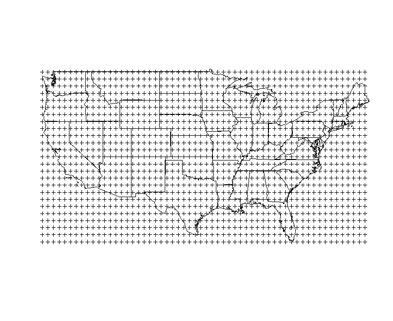
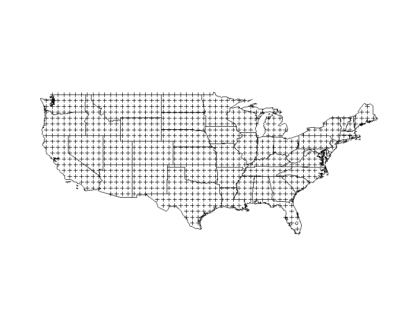
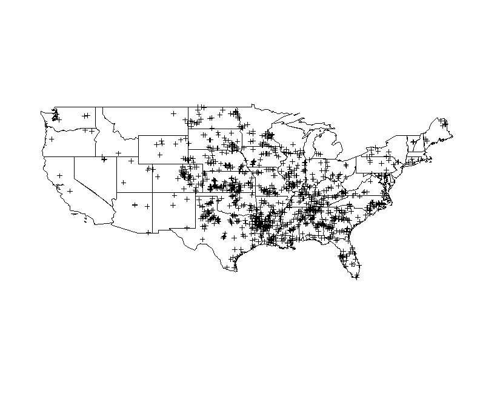

Unit 1
========================================================


```r
### R code from vignette source 'unit1.Rnw'

##### code chunk number 1: unit1.Rnw:198-211
library(sp)
```

```
## Warning: package 'sp' was built under R version 3.0.3
```

```r

d <- read.csv(file = "datasets/2009_torn.csv", header = FALSE)
# Names obtained from accompanying description file
names(d) <- c("Number", "Year", "Month", "Day", "Date", "Time", "TimeZone", 
    "State", "FIPS", "StateNumber", "EFscale", "Injuries", "Fatalities", "Loss", 
    "CLoss", "SLat", "SLon", "ELat", "ELon", "Length", "Width", "NStates", "SNumber", 
    "SG", "1FIPS", "2FIPS", "3FIPS", "4FIPS")

coords <- SpatialPoints(d[, c("SLon", "SLat")])
summary(coords)
```

```
## Object of class SpatialPoints
## Coordinates:
##         min max
## SLon -158.1   0
## SLat    0.0  49
## Is projected: NA 
## proj4string : [NA]
## Number of points: 1182
```


### Spatial Points Data Frame - Fatalities

```r

# code chunk number 2: unit1.Rnw:224-228

storn <- SpatialPointsDataFrame(coords, d)
names(storn)
```

```
##  [1] "Number"      "Year"        "Month"       "Day"         "Date"       
##  [6] "Time"        "TimeZone"    "State"       "FIPS"        "StateNumber"
## [11] "EFscale"     "Injuries"    "Fatalities"  "Loss"        "CLoss"      
## [16] "SLat"        "SLon"        "ELat"        "ELon"        "Length"     
## [21] "Width"       "NStates"     "SNumber"     "SG"          "1FIPS"      
## [26] "2FIPS"       "3FIPS"       "4FIPS"
```

```r
summary(storn$Fatalities)
```

```
##    Min. 1st Qu.  Median    Mean 3rd Qu.    Max. 
##   0.000   0.000   0.000   0.025   0.000   8.000
```

```r
table(storn$Month)
```

```
## 
##   1   2   3   4   5   6   7   8   9  10  11  12 
##   6  38 117 234 201 274 125  60   8  66   3  50
```


### Spatial Lines - Tornado Trajectories

```r
# code chunk number 3: unit1.Rnw:278-291
sl <- lapply(unique(d$Number), function(X) {
    dd <- d[which(d$Number == X), c("SLon", "SLat", "ELon", "ELat")]
    
    
    L <- lapply(1:nrow(dd), function(i) {
        Line(matrix(as.numeric(dd[i, ]), ncol = 2, byrow = TRUE))
    })
    Lines(L, ID = as.character(X))
})

Tl <- SpatialLines(sl)

summary(Tl)
```

```
## Object of class SpatialLines
## Coordinates:
##      min max
## x -158.1   0
## y    0.0  49
## Is projected: NA 
## proj4string : [NA]
```

### State Boundaries

```r
### code chunk number 4: Tl (eval = FALSE) load('datasets/statesth.RData')
### plot(statesth) plot(Tl, add=TRUE)

### code chunk number 5: unit1.Rnw:316-317

load("datasets/statesth.RData")
plot(statesth)
plot(Tl, add = TRUE)
```

 

### Spatial Lines
- `contourLines2SLDF` : convert a list of contours into an SLDF object

```r
##### code chunk number 6: unit1.Rnw:328-329
library(maptools)
```

```
## Warning: package 'maptools' was built under R version 3.0.3
```

```
## Checking rgeos availability: TRUE
```

```r


##### code chunk number 7: unit1.Rnw:331-336
volcano_sl <- ContourLines2SLDF(contourLines(volcano))
row.names(slot(volcano_sl, "data"))
```

```
##  [1] "C_1"  "C_2"  "C_3"  "C_4"  "C_5"  "C_6"  "C_7"  "C_8"  "C_9"  "C_10"
```

```r
sapply(slot(volcano_sl, "lines"), function(x) slot(x, "ID"))
```

```
##  [1] "C_1"  "C_2"  "C_3"  "C_4"  "C_5"  "C_6"  "C_7"  "C_8"  "C_9"  "C_10"
```

```r
sapply(slot(volcano_sl, "lines"), function(x) length(slot(x, "Lines")))
```

```
##  [1] 3 4 1 1 1 2 2 3 2 1
```

```r
volcano_sl$level
```

```
##  [1] 100 110 120 130 140 150 160 170 180 190
## Levels: 100 110 120 130 140 150 160 170 180 190
```

### Grids

```r
##### code chunk number 8: unit1.Rnw:400-414 Step of the grid
h <- 1

xrange <- diff(bbox(statesth)[1, ])
yrange <- diff(bbox(statesth)[2, ])

nx <- ceiling((xrange/h))
ny <- ceiling(yrange/h)

grdtop <- GridTopology(cellcentre.offset = bbox(statesth)[, 1], cellsize = c(h, 
    h), cells.dim = c(nx, ny))

grd <- SpatialGrid(grdtop, proj4string = CRS("+proj=longlat"))

```

#### Grid over US states

```r

##### code chunk number 9: grd (eval = FALSE) plot(grd) plot(statesth, add=TRUE)

##### code chunk number 10: unit1.Rnw:426-427
plot(grd)
plot(statesth, add = TRUE)
```

 

```r


##### code chunk number 11: unit1.Rnw:443-448
grdidx <- overlay(grd, statesth)

grd2 <- SpatialPixels(SpatialPoints(coordinates(grd))[!is.na(grdidx), ])
proj4string(grd) <- CRS("+proj=longlat")
```


```r

##### code chunk number 12: grd2 (eval = FALSE) plot(grd2) plot(statesth,
##### add=TRUE)

```


```r

##### code chunk number 13: unit1.Rnw:458-459
plot(grd2)
plot(statesth, add = TRUE)
```

 

```r


##### code chunk number 14: unit1.Rnw:565-568
sidx <- overlay(storn, statesth)
storn2 <- storn[!is.na(sidx), ]
```


```r

##### code chunk number 15: plot2 (eval = FALSE) plot(storn2) plot(statesth,
##### add=TRUE)


##### code chunk number 16: unit1.Rnw:578-579
plot(storn2)
plot(statesth, add = TRUE)
```

 


```r

##### code chunk number 17: unit1.Rnw:604-605
save(file = "results/unit1.RData", list = ls())

```


